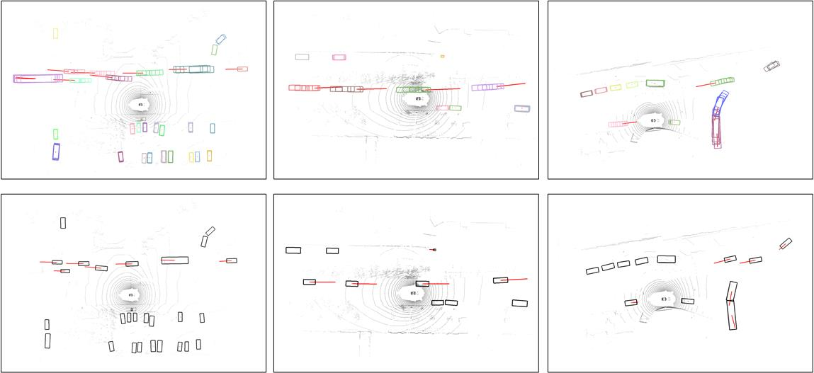
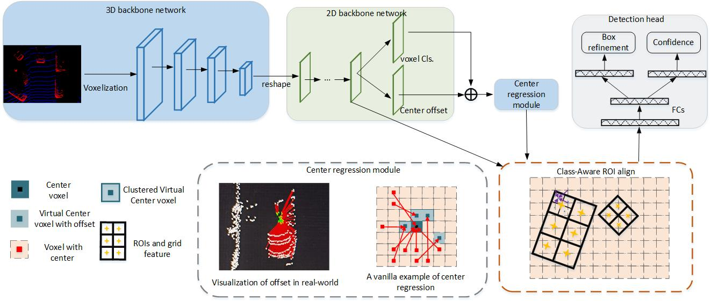
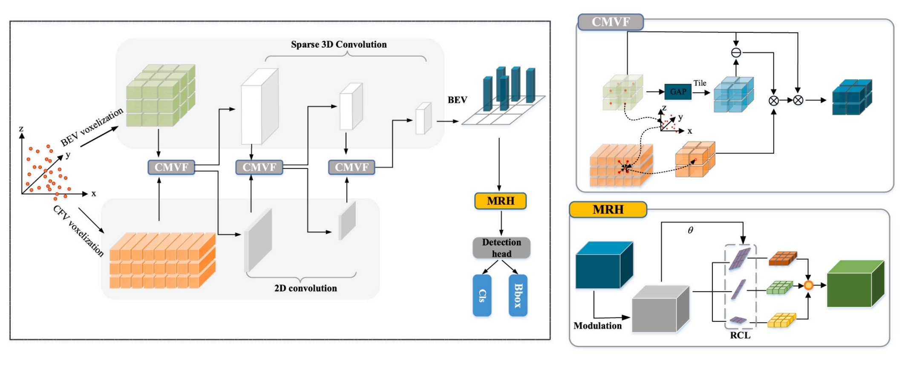
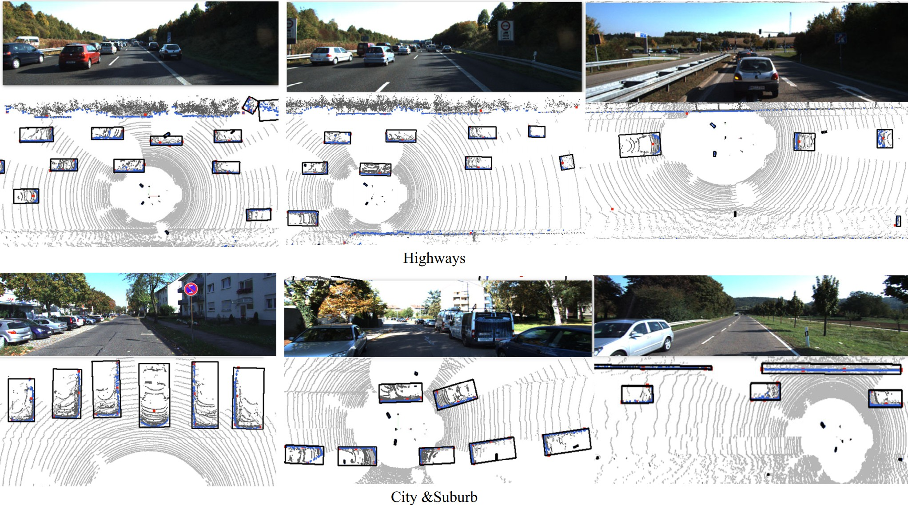
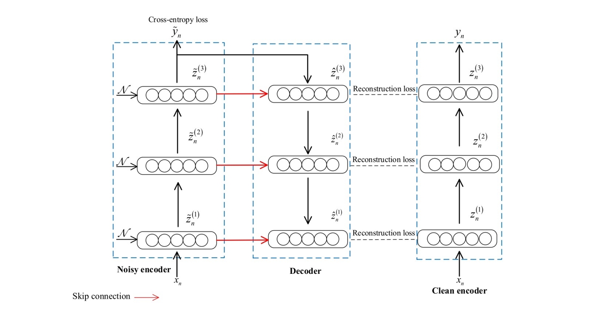
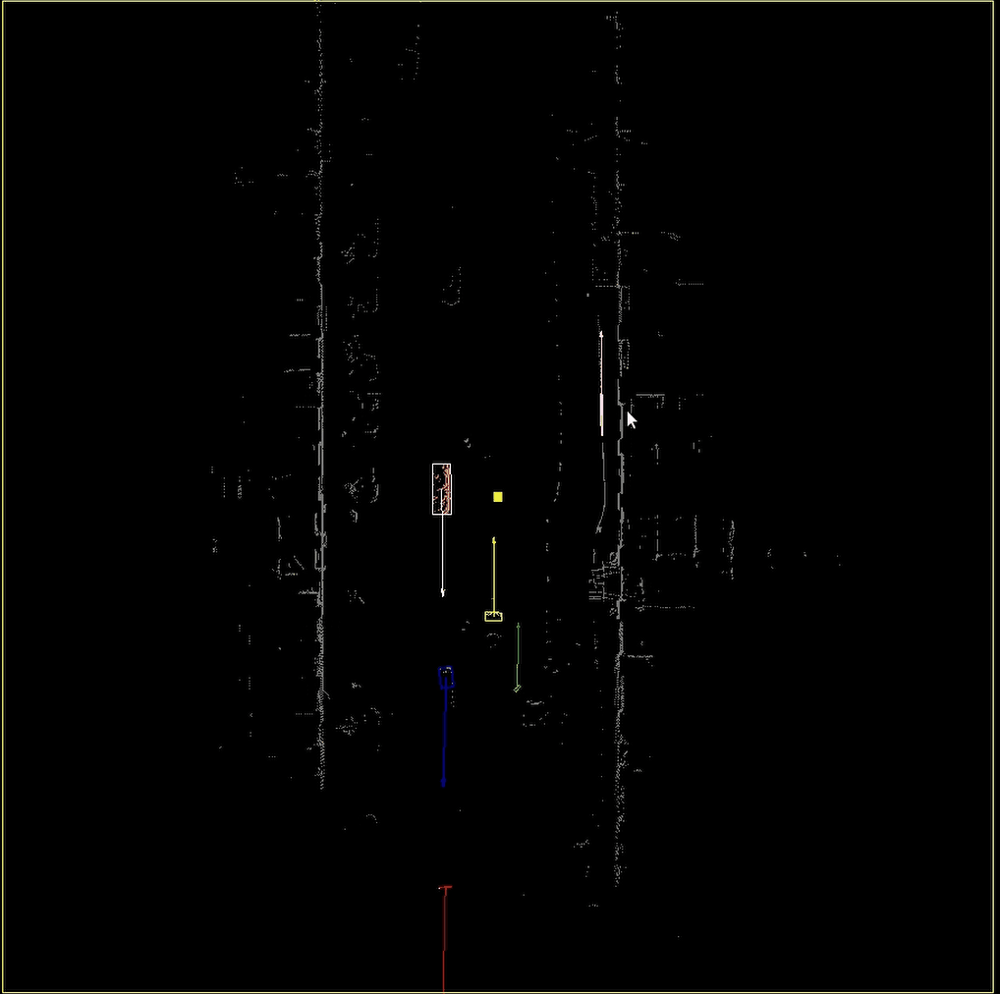

 <h1>Jing Sun 孙静</h1> 

Research on 3D object detection for lidar data in intelligent driving scenarios. Aiming at the problem of poor detection results caused by sparse point clouds and occlusions in intelligent driving scenarios, the feature extraction module and target detection module in the target detection model are targeted to improve the target detection effect. achievement.

        

## Research

 
 
 

&#x2003;[ Offset3net: Simple joint 3D detection and tracking with three-step offset learning(major revision)](https://www.sciencedirect.com/science/article/abs/pii/S0045790621005978)   
&#x2003; Jing Sun, Yimu Ji, Jing He, Fei Wu, Yanfei Sun.  
&#x2003; IEEE Transactions on Industrial Informatic.
 
 

 

&#x2003;[Semantic-aware 3D-voxel CenterNet for point cloud object detection](https://www.sciencedirect.com/science/article/abs/pii/S0045790621005978)  
&#x2003;Jing Sun, Yimu Ji, Fei Wu, Yanfei Sun.  
&#x2003;Computers & Electrical Engineering, 2022, 98: 107677.
  

 

&#x2003;[Cascaded multi-3D-view fusion for 3D-oriented object detection](https://www.sciencedirect.com/science/article/abs/pii/S0045790622005341)  
&#x2003;Jing Sun, Jing Xu, Yi-Mu Ji, Fei Wu, Yanfei Sun  
&#x2003;Computers & Electrical Engineering, 2022, 103: 108312.
  

 
 

&#x2003;[Dynamic Vehicle Pose Estimation with Heuristic L-Shape Fitting and Grid-Based Particle Filter](https://www.mdpi.com/2079-9292/12/8/1903)  
&#x2003;Jing Sun, Yimu Ji, Shangdong Liu.  
&#x2003;Electronics, 2023, 12(8): 1903.
  

 
 

&#x2003;[Cost-Sensitive and Sparse Ladder Network for Software Defect Prediction](https://www.jstage.jst.go.jp/article/transinf/E103.D/5/E103.D_2019EDL8198/_pdf)  
&#x2003;Jing Sun, Yimu Ji, Shandong Liu, Fei Wu.  
&#x2003;IEICE Transactions on Information and Systems, 2020, 103(5): 1177-1180.
  

# new job

&#x2003;[Cost-Sensitive and Sparse Ladder Network for Software Defect Prediction](https://www.jstage.jst.go.jp/article/transinf/E103.D/5/E103.D_2019EDL8198/_pdf)  
&#x2003;Jing Sun, Yimu Ji, Shandong Liu, Fei Wu.  
&#x2003;IEICE Transactions on Information and Systems, 2020, 103(5): 1177-1180.
  
  

